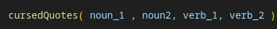

# Cursed Quotes

### "I prefer dangerous bananas over peaceful apes." 
### -Thomas Jefferson

## Description
#### The purpose of this project is to create a function in javascript that will scramble inspirational quotes from historical figures and turn them into nonsensical sentences by the following options:

1. Modify 1 of or up to all 4 of the parameters listed entering as 'string' format. For a total of 15 possible combinations between 2 nouns and 2 verbs.

    
    

2. Simply input the number '1' in the function parentheses to parse a random, cursed quote that changes all 4 parameters randomly.

    

    #### Original Quote: 
    "If you want to make your dreams come true, the first thing you have to do is wake up" - J.M. Power
    #### Cursed Quote: 
    "If you want to slap your leg true, the first thing Ice Cube have to do is scratch" - J.M. Power

#### The intention is to make you laugh, and also provide you quality entertainment.