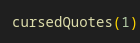

# Cursed Quotes

### "I prefer dangerous bananas over peaceful apes." 
### -Thomas Jefferson

## Description
#### The purpose of this project is to create a function in javascript that will scramble inspirational quotes from historical figures and turn them into nonsensical sentences by the following options:

1. Modify 1 of or up to all 4 of the parameters listed by entering as 'string' format. For a total of 15 possible combinations between 2 nouns and 2 verbs.

    
    

2. Simply input the number '1' in the function parentheses to parse a random, cursed quote that changes all 4 parameters randomly.

    

    #### Original Quote: 
    "If you want to make your dreams come true, the first thing you have to do is wake up" - J.M. Power
    #### Cursed Quote: 
    "If you want to slap your leg true, the first thing Ice Cube have to do is scratch" - J.M. Power

## Installation

#### You will need:

+ VS Code or another text-editor application that can read and write JavaScript files
+ Node.js installed on your computer that can run Javascript files.
    
    [Download & Install here](https://nodejs.org/en)

#### Instructions:

1. Click the top-right button and click: **Download Zip** 

2. Alternatively, you can use **git clone** in your terminal and save to a new directory: 

        git clone https://github.com/thoner1/cursedQuotes.git

3. Once you have downloaded all the files from the repository, simply open **main.js** in VS Code or your favorite JavaScript editor then run **node main.js** to parse a cursed quote.

## Technologies
#### Made with:
+ Javascript 
+ Node.js